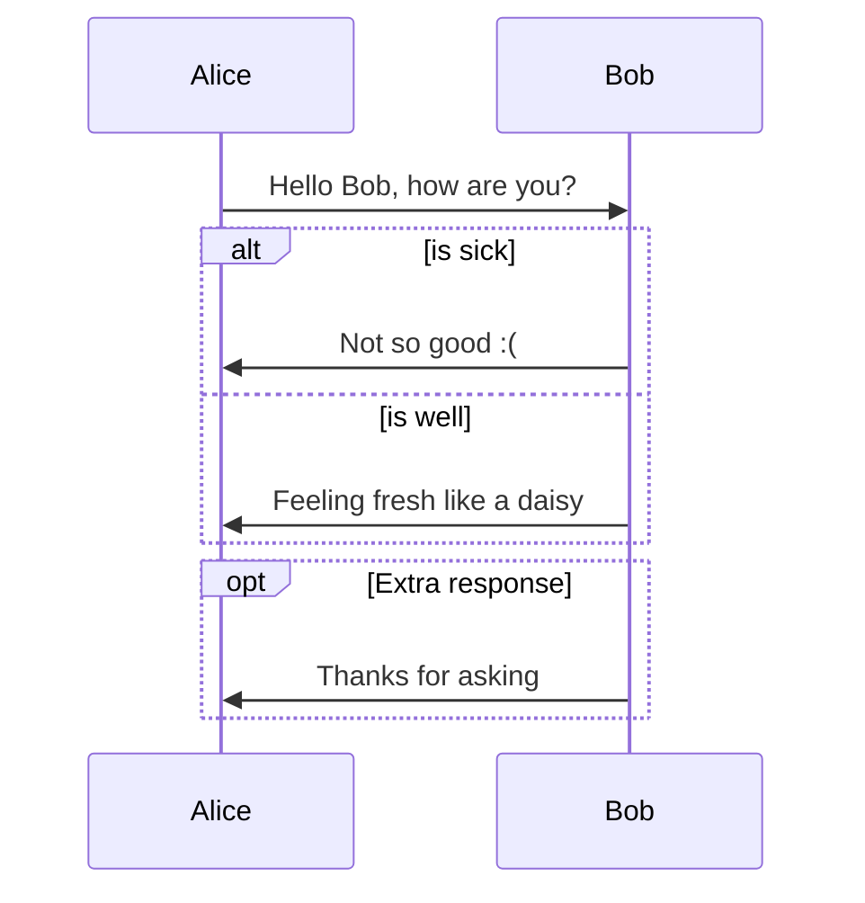
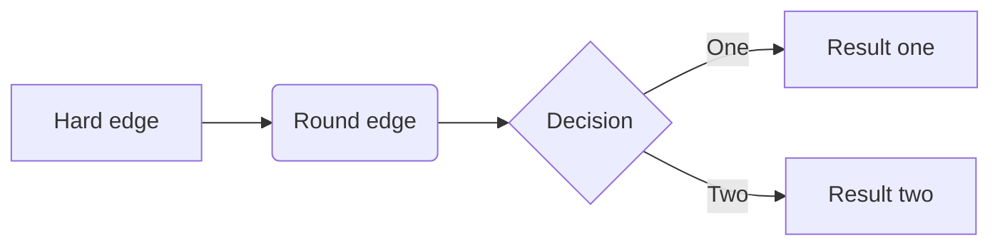
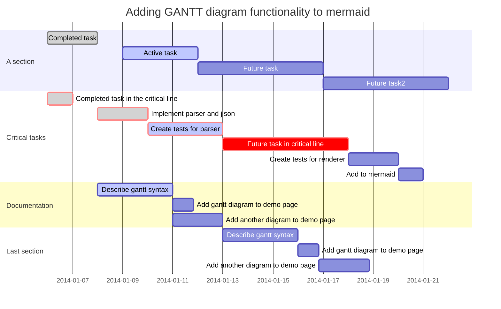

# 用Markdown绘制图表
2016年8月15日 通过 typora.io

[美人鱼的各种用法](https://mermaidjs.github.io/)
>以与markdown类似的方式从文本生成图表和流程图。
>曾经想在解释代码时简化文档并避免像Visio这样的繁重工具吗？
这就是为什么美人鱼诞生了，一种简单的降价式脚本语言，用于通过javascript从文本生成图表。使用我们的编辑器尝试它。

要求捐款
Contribute to 美人鱼：https：//github.com/knsv/mermaid
Contribute to 文档    ：https：//github.com/mermaidjs/mermaid-gitbook

Typora支持图表的某些Markdown扩展，您可以从首选项面板启用此功能。

当导出为HTML，PDF，epub，docx时，也会包含那些呈现的图表，但在当前版本中将markdown导出为其他文件格式时，不支持图表功能。此外，您还应注意标准Markdown，CommonMark或GFM不支持图表。因此，我们仍然建议您插入这些图表的图像，而不是直接在Markdown中写入。

## 序列
它由[js-sequence](https://bramp.github.io/js-sequence-diagrams/#syntax)提供支持，它将跟随代码块转换为渲染图：
```bash
用法:
Alice->Bob: Hello Bob, how are you?
Note right of Bob: Bob thinks
Bob-->Alice: I am good thanks!
```

```sequence
Alice->Bob: Hello Bob, how are you?
Note right of Bob: Bob thinks
Bob-->Alice: I am good thanks!
```

有关语法说明，请参阅[此处](https://bramp.github.io/js-sequence-diagrams/#syntax)。

## 流程图
它由[flowchart.js](http://flowchart.js.org/)提供支持，它将跟随代码块转换为渲染图：
```bash
用法:
st=>start: Start
op1=>operation: Your Operation1
op2=>operation: Your Operation2
cond=>condition: Yes or No?
e=>end

st->op1->op2->cond
cond(yes)->e
cond(no)->op1
```

----

```flow
st=>start: Start
op1=>operation: Your Operation1
op2=>operation: Your Operation2
cond=>condition: Yes or No?
e=>end

st->op1->op2->cond
cond(yes)->e
cond(no)->op1
```

## 美人鱼
Typora还与[美人鱼](https://knsv.github.io/mermaid/#mermaid)集成，支持序列，流程图和甘特图。

序列
看到这个文档
```bash
用法:
%% Example of sequence diagram
  sequenceDiagram
    Alice->>Bob: Hello Bob, how are you?
    alt is sick
    Bob->>Alice: Not so good :(
    else is well
    Bob->>Alice: Feeling fresh like a daisy
    end
    opt Extra response
    Bob->>Alice: Thanks for asking
    end
```

----




流程图
看到这个[文档](https://knsv.github.io/mermaid/#flowcharts-basic-syntax)

```bash
用法:
graph LR
A[Hard edge] -->B(Round edge)
    B --> C{Decision}
    C -->|One| D[Result one]
    C -->|Two| E[Result two]
```

----


Snip20160816_4

甘特图
看到这个[文档](https://mermaidjs.github.io/)

```bash
用法：
%% Example with selection of syntaxes
        gantt
        dateFormat  YYYY-MM-DD
        title Adding GANTT diagram functionality to mermaid

        section A section
        Completed task            :done,    des1, 2014-01-06,2014-01-08
        Active task               :active,  des2, 2014-01-09, 3d
        Future task               :         des3, after des2, 5d
        Future task2               :         des4, after des3, 5d
    
        section Critical tasks
        Completed task in the critical line :crit, done, 2014-01-06,24h
        Implement parser and jison          :crit, done, after des1, 2d
        Create tests for parser             :crit, active, 3d
        Future task in critical line        :crit, 5d
        Create tests for renderer           :2d
        Add to mermaid                      :1d
    
        section Documentation
        Describe gantt syntax               :active, a1, after des1, 3d
        Add gantt diagram to demo page      :after a1  , 20h
        Add another diagram to demo page    :doc1, after a1  , 48h
    
        section Last section
        Describe gantt syntax               :after doc1, 3d
        Add gantt diagram to demo page      : 20h
        Add another diagram to demo page    : 48h
```





```

```